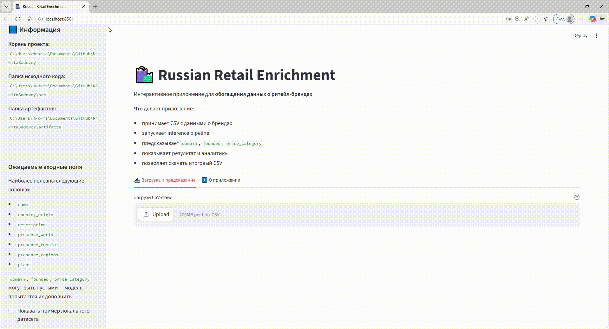
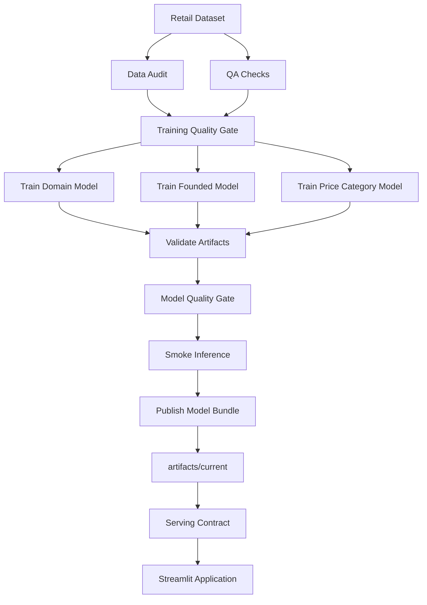
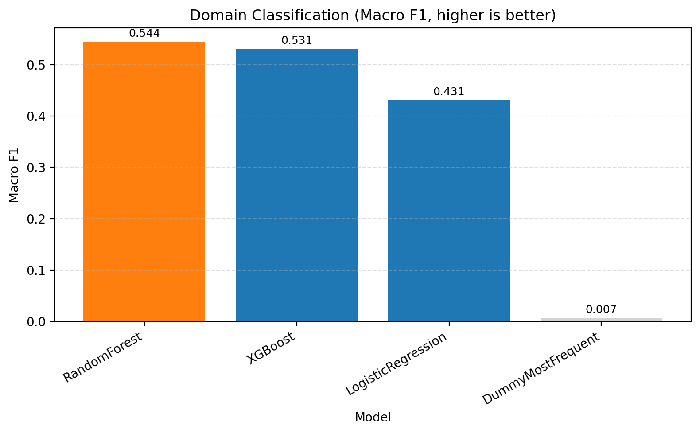
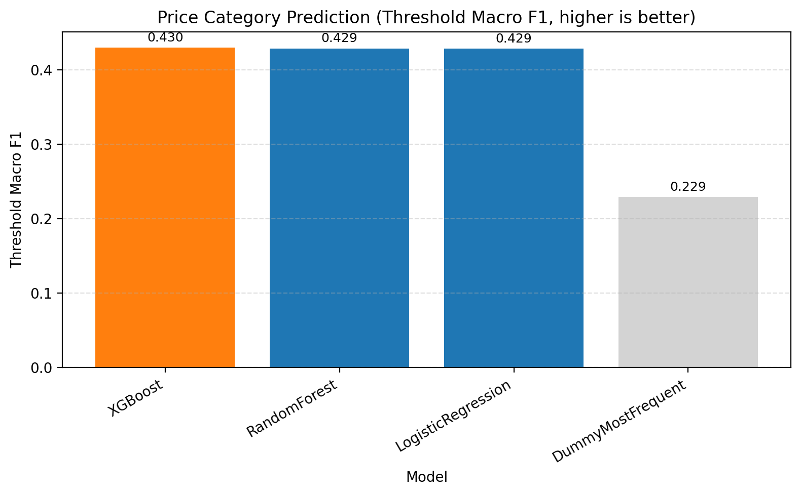
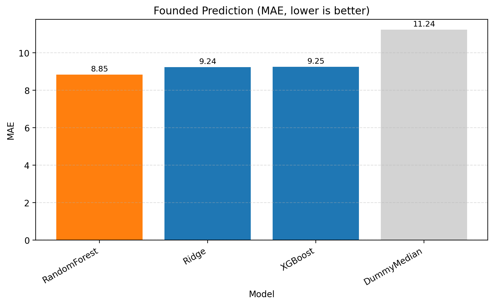

# Russian Retail Enrichment

**End-to-end ML system for retail data enrichment**
**End-to-end ML-система для обогащения неполных данных о ритейл-брендах**

> **English summary:** the project trains, validates, promotes, and serves three independent ML models for retail data enrichment. Apache Airflow orchestrates the training workflow, Docker Compose runs the infrastructure, PostgreSQL stores Airflow metadata, and Streamlit serves only an approved read-only model bundle.

Проект восстанавливает три бизнес-атрибута:

- `domain` — категория бизнеса;
- `founded` — оценка года основания;
- `price_category` — один или несколько ценовых сегментов.

В проекте одновременно представлены три типа ML-задач:

- **multiclass classification**;
- **regression**;
- **multilabel classification**.

---

## 📌 О проекте

Реальные данные о компаниях часто неполные, неоднородные и содержат пропуски. Это снижает их ценность для аналитики, сегментации, отчетности и последующего моделирования.

В этом проекте реализован полный ML workflow:

1. аудит исходных данных;
2. QA-проверки готовности данных к обучению;
3. обучение трех независимых моделей;
4. выбор моделей по cross-validation на development-части данных;
5. финальная оценка на нетронутом holdout;
6. валидация артефактов;
7. model quality gate;
8. smoke inference в serving-сценарии;
9. controlled publication только успешно проверенного model bundle;
10. serving через Streamlit.

Training workflow оркестрируется через **Apache Airflow**. Инфраструктура запускается в **Docker Compose** вместе с **PostgreSQL**. Streamlit работает в отдельном serving-контейнере и получает опубликованные модели через **read-only mount**.

---

## 🏗️ Архитектура системы



Training и serving разделены намеренно:

- **Airflow** отвечает за проверки данных, обучение, валидацию, quality gates, smoke test и публикацию;
- **Streamlit** не берет модели напрямую из произвольной папки training run;
- serving использует только bundle из `artifacts/current`, успешно прошедший полный pipeline;
- опубликованные модели монтируются в Streamlit **только для чтения**.

---

## 🎯 Бизнес-задача

Система предназначена для обогащения неполных retail-данных модельными оценками:

- категория бизнеса;
- год основания;
- ценовой сегмент.

Предсказания следует рассматривать как **data enrichment signals**, а не как официальный справочник.

Особенно важно: `founded` — это приблизительная оценка модели, а не подтвержденный исторический факт.

---

## 🧠 ML-задачи и результаты

| Задача | Тип | Выбранная модель | Финальный holdout |
|---|---|---|---:|
| `domain` | Multiclass classification | Random Forest | Macro F1 ≈ **0.532** |
| `founded` | Regression | Ridge Regression | MAE ≈ **8.89 лет** |
| `price_category` | Multilabel classification | Logistic Regression | Macro F1 ≈ **0.436** |

Дополнительные holdout-метрики для `price_category`:

- Micro F1 ≈ **0.701**;
- Samples F1 ≈ **0.740**.

### Domain

`domain` решается как многоклассовая классификация. Финальным победителем по development CV стал **Random Forest**.

### Founded

`founded` решается как регрессия. Финальная модель — **Ridge Regression**. Во время evaluation и serving предсказания ограничиваются допустимым диапазоном годов.

### Price Category

`price_category` — multilabel classification. Модель может предсказывать несколько ценовых сегментов одновременно.

Известные target labels:

- `дисконт`;
- `ниже среднего`;
- `средний`;
- `выше среднего`;
- `люкс / премиум`.

Значение `неизвестно` не обучается как отдельный класс: строки, содержащие только неизвестную цену, трактуются как отсутствие target-информации.

---

## 🔬 Training / Evaluation Strategy

Все три модели используют единый **training/serving feature contract**.

Target-поля запрещены как predictors:

- `domain`;
- `founded`;
- `price_category`.

Также из общего serving contract исключены поля, которые могут быть недоступны при реальном inference, например `total_rented_area`.

Это защищает pipeline от:

- **target leakage**;
- **cascading target leakage**;
- **train-serving skew**.

### Validation protocol

Для model selection используется только development-часть данных и cross-validation. Финальный holdout не участвует в выборе модели.

Для `price_category` используется отдельный порядок:

1. winner выбирается по development CV Macro F1;
2. thresholds оптимизируются по out-of-fold probabilities на development data;
3. только после model + threshold selection выполняется финальная оценка на untouched holdout.

Таким образом, holdout остается независимой оценкой generalization quality.

---

## 🌬️ Airflow Training Pipeline

Главный DAG:

```text
dags/retail_training_pipeline.py
```

Workflow:

```text
check_input
  ├── run_all_audits
  └── run_qa_checks
          \ /
       quality_gate
           |
    ┌──────┼────────┐
    |      |        |
 domain  founded   price
    |      |        |
    └──────┼────────┘
           |
 validate_artifacts
           |
 model_quality_gate
           |
 smoke_inference
           |
 publish_models
```

Ключевые этапы:

- `check_input` — проверяет наличие обязательных скриптов, конфигурации и dataset;
- `run_all_audits` — выполняет аудит схемы и качества данных;
- `run_qa_checks` — проверяет training readiness;
- `quality_gate` — не допускает обучение при критических проблемах данных;
- `train_domain`, `train_founded`, `train_price_category` — обучают три независимые задачи;
- `validate_artifacts` — проверяет файлы моделей, metadata, feature contract и совместимость артефактов;
- `model_quality_gate` — применяет пороговые требования к качеству моделей;
- `smoke_inference` — выполняет representative inference на входе без target-колонок;
- `publish_models` — публикует bundle только после успешного прохождения всех предыдущих этапов.

---

## ✅ Model Validation & Promotion

Модели не используются для serving сразу после `fit()`.

Перед публикацией bundle проходит:

```text
artifact validation
        ↓
model quality gate
        ↓
smoke inference
        ↓
publication
```

Только после этого модельный набор появляется в:

```text
artifacts/current/
```

В published bundle входят модели трех задач, serving metadata, evidence от проверок и `manifest.json`.

Manifest фиксирует, в частности:

- source Airflow run;
- timestamp публикации;
- dataset SHA-256;
- feature-contract version;
- quality-policy version;
- winner для каждой ML-задачи;
- статусы обязательных validation stages.

Публикация выполняется через staging directory перед заменой `artifacts/current`, что снижает риск показать serving-приложению частично скопированный набор моделей.

---

## 🔒 Serving Contract

Перед inference Streamlit проверяет опубликованный bundle через:

```text
src/serving_contract.py
```

Проверяется, что:

- bundle существует;
- `manifest.json` корректен;
- version manifest соответствует ожидаемой;
- feature-contract version совместима;
- model quality gate имеет статус `PASSED`;
- smoke inference имеет статус `PASSED`;
- присутствуют все три model entries;
- обязательные serving-файлы существуют и не пусты.

Если contract не выполнен, приложение **fails closed** — inference не запускается на непроверенных моделях.

---

## 🖥️ Streamlit Application

Приложение поддерживает:

- загрузку CSV;
- batch inference;
- просмотр обогащенного dataset;
- summary statistics;
- metadata текущего model bundle;
- встроенный пример serving input;
- скачивание результата.

Streamlit работает в отдельном Docker image и читает модели из:

```text
/app/artifacts/current
```

Host-папка `artifacts/` подключается в serving container как **read-only**.

Docker Compose также содержит healthcheck для Streamlit.

### Пример serving input

В репозитории есть небольшой синтетический пример:

```text
app/sample_input.csv
```

Он содержит только raw serving fields и намеренно не включает target-колонки.

Основные входные поля:

```text
name
country_origin
description
presence_world
presence_russia
presence_regions
plans
```

Выход включает:

```text
pred_domain
estimated_founded
pred_price_category
```

---

## 🐳 Docker Compose

В одном Compose stack запускаются:

```text
PostgreSQL
Airflow API Server
Airflow Scheduler
Airflow DAG Processor
Airflow Triggerer
Airflow Init
Streamlit
```

`airflow-init` — one-shot container: выполняет миграцию metadata DB и после успешного завершения имеет статус `Exited (0)`.

Training image и Streamlit image разделены, чтобы serving не тянул лишние orchestration dependencies и не зависел от runtime Airflow.

---

## 🚀 Quick Start

### 1. Требования

Нужны:

- Git;
- Docker Desktop / Docker Engine с Docker Compose;
- исходный dataset для полного training workflow.

### 2. Clone

```bash
git clone https://github.com/Nikita121191/Project-retail-enrichment.git
cd Project-retail-enrichment
```

### 3. Environment variables

Создайте локальный `.env` из примера:

```bash
cp .env.example .env
```

`.env.example` содержит только placeholders. Для реального запуска замените их случайными секретами.

Сгенерировать значение можно, например, так:

```bash
python -c "import secrets; print(secrets.token_urlsafe(64))"
```

Для двух переменных используйте разные значения.

Настоящий `.env` не должен попадать в Git.

### 4. Training dataset

Для полного training workflow поместите исходный файл в ожидаемое место:

```text
data/russian_retail.csv
```

Dataset намеренно не хранится в Git вместе с generated model artifacts.

### 5. Запуск stack

```bash
docker compose up -d --build
```

Проверка:

```bash
docker compose ps -a
```

После старта:

- Airflow UI: `http://localhost:8082`
- Streamlit: `http://localhost:8501`

### 6. Первый запуск моделей

На чистом clone папка `artifacts/current` еще отсутствует. Это ожидаемое поведение.

До первой успешной публикации Streamlit запустится, но serving contract не позволит выполнять inference без approved model bundle.

В Airflow запустите DAG:

```text
retail_training_pipeline
```

После успешного прохождения pipeline будет создан опубликованный bundle:

```text
artifacts/current/
```

После этого Streamlit становится serving-ready.

### 7. Проверка health

PostgreSQL:

```bash
docker compose exec postgres pg_isready -U airflow -d airflow
```

Streamlit:

```bash
docker compose exec streamlit python -c "import urllib.request; print(urllib.request.urlopen('http://127.0.0.1:8501/_stcore/health', timeout=2).read().decode())"
```

Ожидаемый ответ Streamlit:

```text
ok
```

---

## 📊 Визуализации

### Tableau Dashboard


### Domain Models



### Price Category Models



### Founded Models



---

## 📁 Структура проекта

```text
Project-retail-enrichment/
│
├── app/
│   ├── app.py
│   └── sample_input.csv
│
├── config/
│   └── model_quality_thresholds.json
│
├── dags/
│   └── retail_training_pipeline.py
│
├── docker/
│   └── streamlit/
│       └── Dockerfile
│
├── src/
│   ├── audit/
│   ├── model_contract.py
│   ├── model_quality_gate.py
│   ├── predict_all.py
│   ├── preprocessing.py
│   ├── publish_models.py
│   ├── qa_checks.py
│   ├── run_all_audits.py
│   ├── serving_contract.py
│   ├── smoke_inference.py
│   ├── train_domain.py
│   ├── train_founded.py
│   ├── train_price_category.py
│   └── validate_artifacts.py
│
├── data/                    # local training data, not committed
├── artifacts/               # generated model artifacts, not committed
├── notebooks/
├── images/
├── tableau/
│
├── Dockerfile               # Airflow/training image
├── compose.yml
├── requirements.txt
├── requirements-serving.txt
├── .env.example
└── README.md
```

---

## 🛠️ Tech Stack

**Data / ML**

- Python
- pandas
- NumPy
- scikit-learn
- XGBoost

**ML Engineering / Orchestration**

- Apache Airflow
- Docker
- Docker Compose
- PostgreSQL
- joblib

**Serving / Analytics**

- Streamlit
- Matplotlib
- Tableau

**Engineering practices**

- explicit training/serving feature contract;
- cross-validation + untouched holdout;
- out-of-fold threshold optimization;
- dataset hashing;
- artifact validation;
- model quality gates;
- smoke inference;
- controlled model publication;
- fail-closed serving contract;
- read-only model serving mount.

---

## ⚠️ Ограничения

- Dataset относительно небольшой — около 2.7k записей.
- Модели ориентированы на retail-domain и могут плохо переноситься на out-of-domain компании.
- `founded` является приблизительной оценкой.
- Некоторые classes представлены значительно слабее других.
- `price_category` склонен чаще предсказывать более распространенные ценовые сегменты.
- Проект не использует внешний production model registry.
- Нет online feature store и model-drift monitoring.
- Cloud deployment и CI/CD не являются частью текущей версии проекта.

Эти ограничения намеренно фиксируются, чтобы отделить демонстрацию архитектуры и ML methodology от заявлений о production accuracy на больших внешних данных.

---

## 🔮 Возможные улучшения

- расширение и ребалансировка dataset;
- confidence scores / calibrated probabilities;
- более глубокий error analysis для редких domain classes;
- model registry;
- automated CI checks;
- cloud deployment;
- monitoring качества и data drift;
- API serving layer при необходимости интеграции с внешними системами.

---

## 💼 Что демонстрирует проект

Проект показывает не только обучение отдельных моделей, но и полный model lifecycle:

```text
data quality
    ↓
training
    ↓
evaluation
    ↓
validation
    ↓
quality gate
    ↓
smoke inference
    ↓
publication
    ↓
serving
```

Основной акцент — на том, чтобы training и serving были согласованы, а приложение использовало только проверенные и опубликованные артефакты.

---

## 👤 Author

**Nikita Sadovoy**

GitHub: [Nikita121191](https://github.com/Nikita121191)
